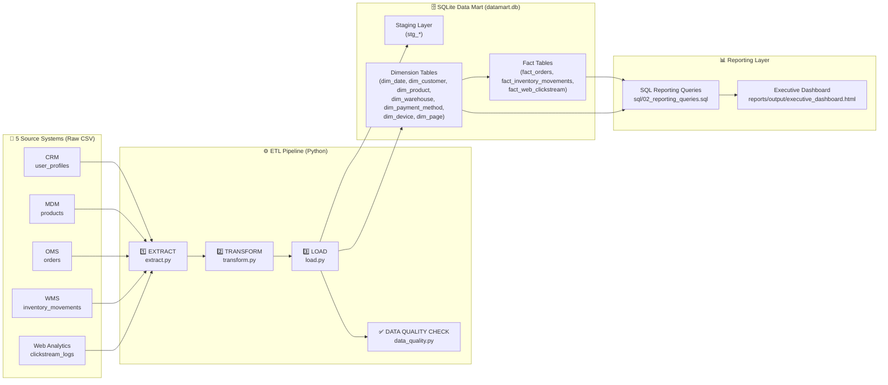
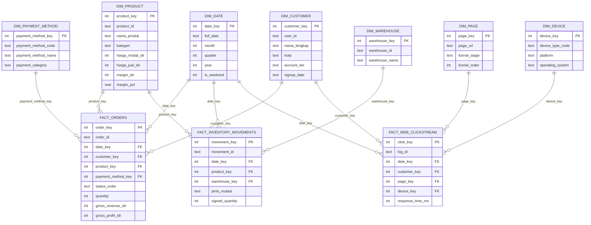
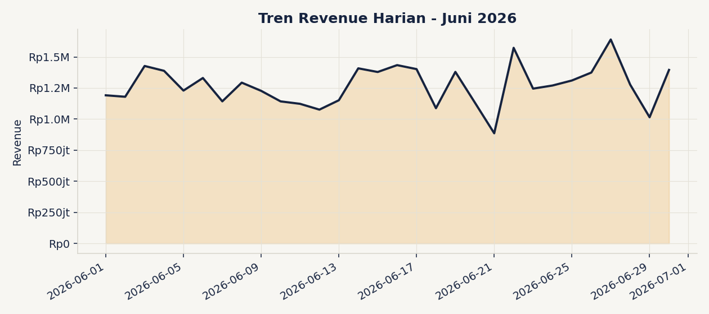
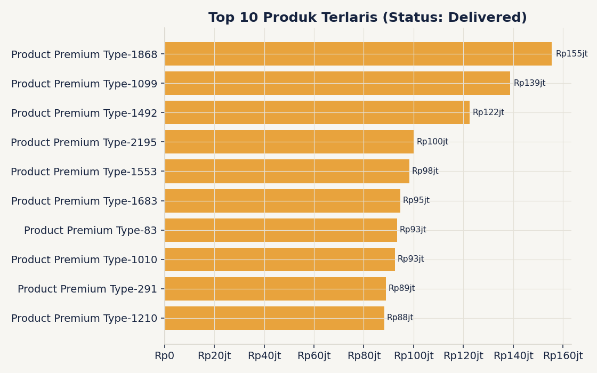
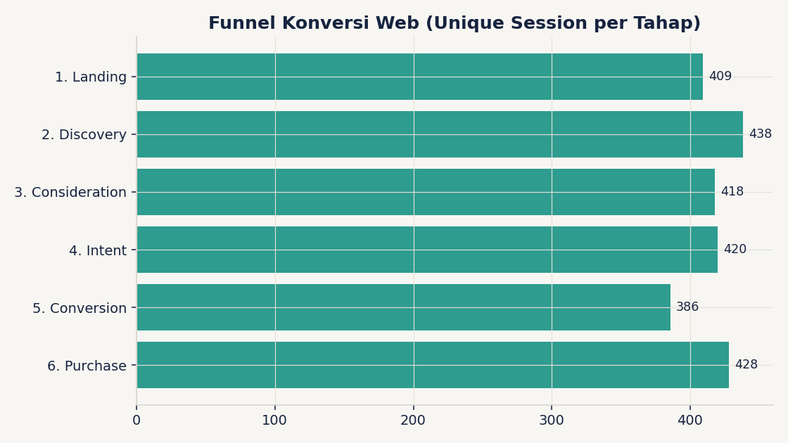
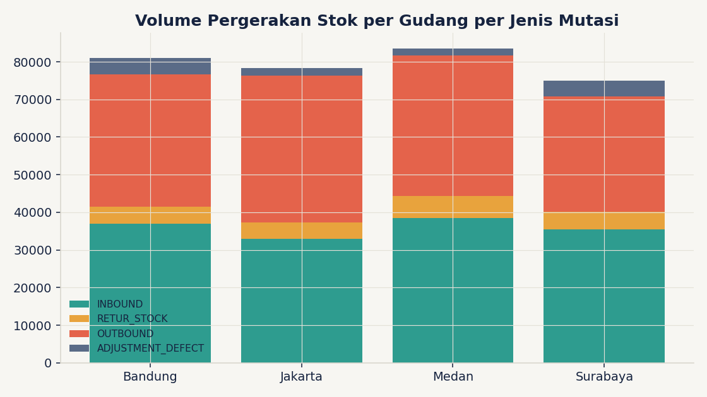
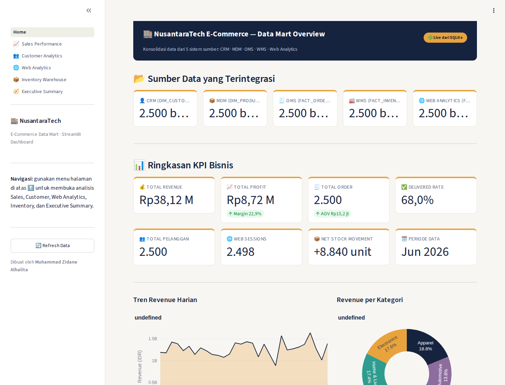
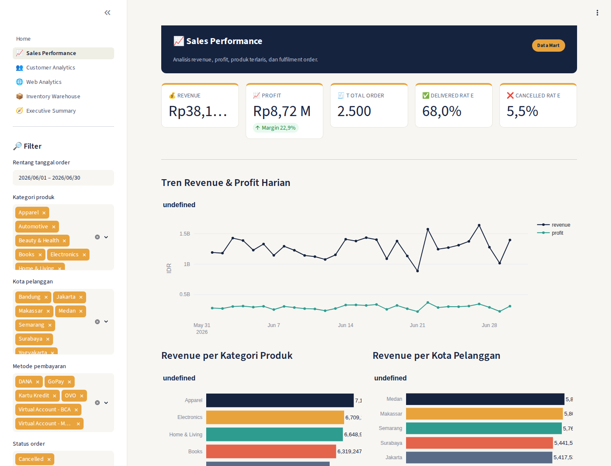
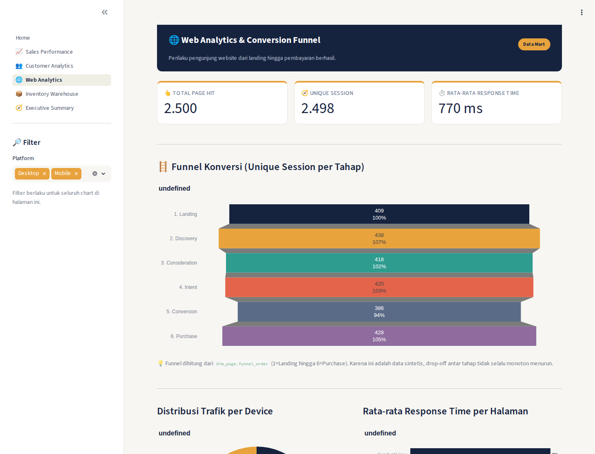
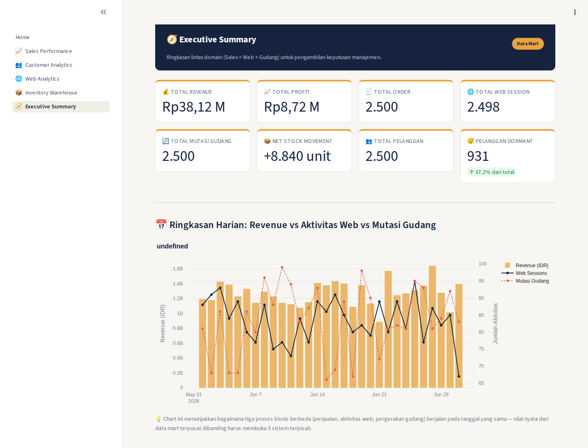

# 🏬 NusantaraTech E-Commerce Data Mart

**End-to-end Data Mart project**: mengintegrasikan 5 sistem sumber (CRM, MDM, OMS, WMS, dan Web
Analytics) milik sebuah perusahaan e-commerce fiktif menjadi satu **star-schema data mart**
yang siap dipakai untuk pelaporan bisnis (MIS/BI), lengkap dengan pipeline ETL, data quality
framework, dan dashboard eksekutif.

Dibuat sebagai **portfolio project** untuk melamar posisi **Data Mart Intern**, sebagai bukti
kemampuan praktis pada aspek **IT, Database Programming, SQL, Management Information System
(MIS), dan Reporting**.

> **Author:** Muhammad Zidane Alhalita

---

## 📌 Daftar Isi

1. [Ringkasan Proyek](#-ringkasan-proyek)
2. [Konteks & Tujuan Bisnis](#-konteks--tujuan-bisnis)
3. [Arsitektur Data Mart](#-arsitektur-data-mart)
4. [Tech Stack](#-tech-stack)
5. [Sumber Data](#-sumber-data)
6. [Desain Data Mart (Star Schema)](#-desain-data-mart-star-schema)
7. [Pipeline ETL](#-pipeline-etl)
8. [Data Quality Framework](#-data-quality-framework)
9. [Reporting & Dashboard](#-reporting--dashboard)
10. [Dashboard Interaktif (Streamlit)](#-dashboard-interaktif-streamlit)
11. [Insight Bisnis Utama](#-insight-bisnis-utama)
12. [Struktur Folder](#-struktur-folder)
13. [Cara Menjalankan Proyek](#-cara-menjalankan-proyek)
14. [Contoh Query SQL](#-contoh-query-sql)
15. [Potensi Pengembangan Lanjutan](#-potensi-pengembangan-lanjutan)
16. [Tentang Penulis](#-tentang-penulis)

---

## 🧭 Ringkasan Proyek

Sebuah perusahaan e-commerce ("NusantaraTech") memiliki data yang tersebar di **5 sistem
operasional yang berbeda** dan tidak saling terhubung:

| Sistem Sumber | Kepanjangan | Fungsi | File |
|---|---|---|---|
| **CRM** | Customer Relationship Management | Menyimpan profil & data pelanggan | `crm_user_profiles.csv` |
| **MDM** | Master Data Management | Menyimpan katalog & master data produk | `mdm_products.csv` |
| **OMS** | Order Management System | Mencatat transaksi/order pelanggan | `oms_orders.csv` |
| **WMS** | Warehouse Management System | Mencatat pergerakan stok di gudang | `wms_inventory_movements.csv` |
| **Web Analytics** | Clickstream Logs | Mencatat aktivitas/klik pengguna di website | `web_clickstream_logs.csv` |

Karena tersebar di 5 sistem yang berbeda, tim bisnis (Sales, Marketing, Inventory, Product)
kesulitan mendapat **satu versi kebenaran (single source of truth)** untuk pengambilan
keputusan. Proyek ini membangun **data mart terpusat** yang mengonsolidasikan kelima sumber
tersebut ke dalam model dimensional (**star schema**) yang dioptimalkan untuk query analitik &
pelaporan cepat.

Seluruh pipeline — mulai dari extract data mentah, transformasi & pembersihan, pembuatan
surrogate key, loading ke data warehouse, validasi kualitas data, hingga pembuatan dashboard —
diimplementasikan dari nol menggunakan **Python (pandas) + SQL murni + SQLite**, tanpa
bergantung pada tools BI komersial, agar setiap langkah proses dapat diaudit dan direproduksi
oleh siapa pun.

---

## 🎯 Konteks & Tujuan Bisnis

Beberapa pertanyaan bisnis yang **tidak bisa langsung dijawab** ketika data masih tersebar di 5
sistem terpisah, tetapi bisa dijawab dengan mudah setelah data mart ini dibangun:

- Berapa **revenue & profit** bulanan, dan kategori produk mana yang paling menguntungkan?
- Kota / segmen pelanggan mana yang paling banyak menyumbang revenue?
- Bagaimana **funnel konversi** pengunjung website dari landing hingga pembayaran berhasil?
- Gudang mana yang stoknya menipis dan butuh restock segera?
- Produk mana yang paling sering mengalami kerusakan/retur, sehingga perlu ditinjau kualitasnya?
- Apakah ada korelasi antara trafik web, aktivitas gudang, dan penjualan pada hari yang sama?

Tujuan proyek:

1. Membangun **data mart** dengan skema dimensional (Kimball star schema) yang *query-friendly*.
2. Mengimplementasikan **pipeline ETL** yang modular, idempotent, dan ter-log (auditable).
3. Menjamin **kualitas data** melalui serangkaian data quality check otomatis.
4. Menyediakan **query SQL siap pakai** untuk kebutuhan reporting/MIS lintas divisi.
5. Menghasilkan **dashboard eksekutif** sebagai output akhir yang mudah dikonsumsi oleh
   non-teknis (management).

---

## 🏗 Arsitektur Data Mart



**Alur singkat:**
1. **Extract** — membaca 5 file CSV mentah & memvalidasi struktur kolomnya.
2. **Transform** — membersihkan data, menghitung metrik turunan (revenue, profit, margin, dsb),
   dan membangun tabel dimensi & fakta lengkap dengan surrogate key.
3. **Load** — menjalankan DDL untuk membuat skema, lalu memuat staging → dimensi → fakta ke
   SQLite (urutan ini penting untuk menjaga integritas foreign key).
4. **Data Quality Check** — 17 pemeriksaan otomatis (row-count reconciliation, referential
   integrity, uniqueness, business-rule sanity) dijalankan setelah load selesai.
5. **Reporting** — query SQL & dashboard HTML dibangun di atas data mart yang sudah bersih.

---

## 🛠 Tech Stack

| Kategori | Tools/Teknologi | Alasan Pemilihan |
|---|---|---|
| **Bahasa Pemrograman** | Python 3.12 | Fleksibel untuk ETL & data wrangling |
| **Database Engine** | SQLite 3 | Portable, tanpa server, mudah di-clone & dijalankan siapa saja dari GitHub |
| **Data Manipulation** | pandas | Transformasi data tabular yang efisien |
| **Visualisasi (statis)** | matplotlib | Membuat chart statis untuk dashboard/report HTML |
| **Visualisasi (interaktif)** | Plotly | Chart interaktif (hover, zoom) di dashboard Streamlit |
| **Web App Framework** | Streamlit | Dashboard interaktif multipage dengan filter dinamis |
| **Query Language** | SQL (DDL, DML, Analytical SQL) | Kompetensi inti posisi Data Mart |
| **Modeling** | Kimball Dimensional Modeling (Star Schema) | Standar industri untuk data warehouse/mart |
| **Version Control** | Git & GitHub | Kolaborasi & showcase portfolio |

> **Catatan:** SQLite dipilih agar reviewer/recruiter dapat langsung `clone` repo ini dan
> menjalankannya tanpa instalasi database server (PostgreSQL/MySQL). Seluruh SQL DDL & query
> ditulis dengan gaya yang **portable** dan mudah dipindahkan (porting) ke database engine lain
> seperti PostgreSQL atau SQL Server bila diperlukan di lingkungan produksi.

---

## 📥 Sumber Data

Kelima file berada di `data/raw/`. Semua data merupakan **data sintetis** (dummy) yang dirancang
menyerupai kondisi nyata sebuah platform e-commerce, dengan periode data:

| Source | Jumlah Baris | Rentang Waktu | Kondisi Kualitas Data |
|---|---:|---|---|
| `crm_user_profiles.csv` | 2.500 | Signup: Jan–Des 2025 | 0 null, 0 duplikat, `user_id` unik |
| `mdm_products.csv` | 2.500 | — (master data) | 0 null, 0 duplikat, `product_id` unik |
| `oms_orders.csv` | 2.500 | Order: Jun 2026 | 0 null, 0 duplikat, 100% FK valid ke CRM & MDM |
| `wms_inventory_movements.csv` | 2.500 | Jun 2026 | 0 null, 0 duplikat, 100% FK valid ke MDM |
| `web_clickstream_logs.csv` | 2.500 | Jun 2026 | 0 null, 0 duplikat, 100% FK valid ke CRM |

Detail definisi setiap kolom tersedia di [`docs/data_dictionary.md`](docs/data_dictionary.md).

---

## ⭐ Desain Data Mart (Star Schema)

Data mart dirancang menggunakan pendekatan **Kimball Dimensional Modeling** dengan **3 fact
table** (masing-masing merepresentasikan satu proses bisnis) yang berbagi **conformed
dimension** (`dim_date`, `dim_customer`, `dim_product`).



### Grain (tingkat kedetailan) setiap fact table

| Fact Table | Grain | Proses Bisnis |
|---|---|---|
| `fact_orders` | 1 baris = 1 order | Penjualan / Order Management |
| `fact_inventory_movements` | 1 baris = 1 pergerakan stok | Manajemen Gudang |
| `fact_web_clickstream` | 1 baris = 1 page-hit | Aktivitas Web / Customer Journey |

### Keputusan desain penting

- **`dim_date` sebagai conformed dimension**: digenerate oleh ETL (bukan dari source manapun),
  dipakai bersama oleh ketiga fact table sehingga analisis time-series lintas domain (mis.
  "revenue vs trafik web pada tanggal yang sama") menjadi query `JOIN` sederhana (lihat query
  **E1** di `sql/02_reporting_queries.sql`).
- **Mini-dimension** (`dim_payment_method`, `dim_device`, `dim_page`) dipisah dari fact table
  agar nama tampilan (business-friendly label) dan kategorisasi bisnis (mis. funnel stage,
  payment category) terpusat di satu tempat, bukan hard-coded di query.
- **Derived dimension** (`dim_warehouse`) diturunkan dari parsing `warehouse_id` (mis.
  `WH-JAKARTA-01` → nama gudang `Jakarta`), menunjukkan kemampuan transformasi data non-trivial.
  Ini menunjukkan proses **denormalisasi** yang disengaja demi kemudahan query.
- **Measure turunan** dihitung di tahap transform, bukan di query (contoh: `gross_revenue_idr`,
  `gross_profit_idr`, `margin_pct`, `signed_quantity`). Ini menjamin konsistensi angka di seluruh
  laporan tanpa risiko rumus berbeda-beda antar query analis.
- **`signed_quantity`** pada `fact_inventory_movements` adalah contoh business-logic encoding:
  `INBOUND`/`RETUR_STOCK` bernilai positif, `OUTBOUND`/`ADJUSTMENT_DEFECT` bernilai negatif,
  sehingga `SUM(signed_quantity)` langsung merepresentasikan estimasi stok bersih tanpa perlu
  `CASE WHEN` berulang di setiap query.
- **Degenerate dimension** (`order_id`, `status_order`, `jenis_mutasi`, `operator_id`) disimpan
  langsung di fact table karena kardinalitasnya rendah/unik dan tidak memerlukan tabel dimensi
  terpisah.

---

## ⚙️ Pipeline ETL

Kode ETL berada di folder `etl/`, dipecah menjadi modul-modul kecil agar mudah diuji & dipelihara:

```
etl/
├── config.py         # Path file, lookup table bisnis (payment method, funnel, dsb.)
├── extract.py         # Tahap 1: baca & validasi CSV mentah
├── transform.py        # Tahap 2: cleaning, kalkulasi measure, bangun dim & fact
├── load.py               # Tahap 3: jalankan DDL, load staging + data mart ke SQLite
├── data_quality.py        # Tahap 4: 17 automated data quality check
└── run_etl.py               # Orchestrator: menjalankan seluruh tahap secara berurutan
```

### Detail tiap tahap

**1. Extract (`extract.py`)**
- Membaca 5 file CSV dengan `pandas.read_csv`.
- Validasi: file harus ada, tidak boleh kosong, kolom wajib harus lengkap sebelum lanjut ke
  tahap berikutnya (fail-fast).

**2. Transform (`transform.py`)**
- Deduplikasi berdasarkan natural key (`user_id`, `product_id`, `order_id`, dst.).
- Konversi tipe data (string timestamp → datetime, `True`/`False` string → boolean/integer).
- Membangun **7 tabel dimensi**, termasuk generate `dim_date` secara dinamis mengikuti rentang
  tanggal aktual pada data (Jan 2025 – Jul 2026, dengan buffer 3 hari).
- Membangun **3 tabel fakta** dengan melakukan *lookup* surrogate key ke dimensi terkait
  (`merge`/join di pandas), lalu menghitung measure turunan (revenue, profit, signed quantity).
- Baris fakta dengan foreign key yang tidak ditemukan di dimensi (**orphan row**) otomatis
  dibuang dan dicatat sebagai warning di log — mengantisipasi skenario data real-world yang
  tidak selalu 100% bersih.

**3. Load (`load.py`)**
- Menjalankan `sql/01_create_schema.sql` untuk membuat ulang seluruh tabel (DDL: `PRIMARY KEY`,
  `FOREIGN KEY`, `UNIQUE`, index) — bukan sekadar `df.to_sql()` tanpa skema.
- Memuat staging layer terlebih dahulu (audit trail data mentah), lalu dimensi, baru fakta —
  urutan ini **wajib** karena `PRAGMA foreign_keys = ON` mengaktifkan enforcement FK di SQLite.
- Setiap langkah load dicatat ke tabel `etl_run_log` (nama step, jumlah baris, waktu mulai/selesai).

**4. Data Quality Check (`data_quality.py`)**
- 17 pemeriksaan otomatis dijalankan setelah load, dikelompokkan menjadi 4 kategori (lihat
  bagian [Data Quality Framework](#-data-quality-framework) di bawah).

### Menjalankan pipeline

```bash
python -m etl.run_etl
```

Contoh output log (ringkas):

```
=== TAHAP 1/3: EXTRACT dimulai ===
Extract 'crm_user_profiles' -> 2500 baris, 6 kolom
...
=== TAHAP 2/3: TRANSFORM dimulai ===
dim_date dibangun: 552 baris (2024-12-29 s.d. 2026-07-03)
fact_orders dibangun: 2500 baris | total revenue = Rp 38,117,363,895
...
=== TAHAP 3/3: LOAD dimulai ===
Schema berhasil dibuat/direset.
  -> fact_orders : 2500 baris ter-load
...
=== DATA QUALITY SUMMARY: 17/17 check PASS ===
PIPELINE SELESAI dalam 1.17 detik
```

---

## ✅ Data Quality Framework

Setelah proses load, pipeline otomatis menjalankan **17 data quality check** yang dikelompokkan
menjadi 4 kategori (implementasi Python: `etl/data_quality.py`; versi pure-SQL yang setara:
`sql/03_data_quality_checks.sql`):

| Kategori | Contoh Check | Jumlah |
|---|---|---:|
| **Row-count reconciliation** | Jumlah baris staging harus sama dengan dimensi/fakta hasil transform | 5 |
| **Referential integrity** | Tidak boleh ada baris fakta dengan foreign key `NULL`/orphan | 8 |
| **Uniqueness** | `order_id`, `user_id` tidak boleh duplikat | 2 |
| **Business rule sanity** | Revenue & quantity tidak boleh negatif, margin produk 0–100% | 3 (+1) |

**Hasil run terakhir: 17/17 check PASS ✅** — detail log tersedia di tabel `etl_run_log` pada
database dan pada output console saat pipeline dijalankan.

Pendekatan ini meniru praktik nyata di lingkungan data warehouse/data mart perusahaan, di mana
proses ETL **tidak dianggap selesai** hanya karena tidak ada error saat loading — validasi
kebenaran & konsistensi data adalah langkah wajib berikutnya.

---

## 📊 Reporting & Dashboard

### 1. SQL Reporting Queries (`sql/02_reporting_queries.sql`)

Berisi **18 query analitik siap pakai**, dikelompokkan ke dalam 5 kategori:

| Kategori | Contoh Analisis |
|---|---|
| **A. Sales & Revenue Performance** | KPI bulanan, revenue per kategori, top 10 produk terlaris, distribusi status order, preferensi metode pembayaran, revenue per kota |
| **B. Customer Analytics** | Segmentasi revenue per account tier, top 10 pelanggan (CLV sederhana), pelanggan yang belum pernah order |
| **C. Web Analytics / Conversion Funnel** | Funnel konversi per tahap, response time per halaman, distribusi trafik per device, conversion rate per kota |
| **D. Inventory / Warehouse Analytics** | Estimasi stok bersih per gudang, ringkasan mutasi stok, produk dengan tingkat kerusakan tertinggi |
| **E. Cross-Domain / Executive Summary** | Ringkasan harian gabungan (sales + web + gudang), kategori profitable namun rawan rusak |

### 2. Executive Dashboard (`reports/output/executive_dashboard.html`)

Dashboard HTML **self-contained** (chart di-*embed* sebagai base64, bisa dibuka langsung di
browser tanpa server) yang merangkum 8 KPI card dan 8 visualisasi utama. Dibuat dengan
`reports/generate_report.py`.

```bash
python -m reports.generate_report
```

Contoh chart yang dihasilkan (tersimpan di `reports/output/charts/`):

**Tren Revenue Harian**



**Top 10 Produk Terlaris**



**Funnel Konversi Web**



**Pergerakan Stok per Gudang**



> 💡 Chart lain (revenue per kategori, distribusi status order, metode pembayaran, distribusi
> device) tersedia di `reports/output/charts/` dan seluruhnya sudah terangkum otomatis di
> `executive_dashboard.html`.

---

## 🖥️ Dashboard Interaktif (Streamlit)

Selain dashboard HTML statis di atas, proyek ini juga menyediakan **dashboard interaktif berbasis
Streamlit + Plotly** (`streamlit_app/`) yang membaca **langsung** dari `db/datamart.db` dan
menyediakan **filter dinamis** (tanggal, kategori, kota, device, gudang, dsb.) di setiap halaman —
cocok untuk eksplorasi data ad-hoc, bukan sekadar laporan statis.

### Menjalankan dashboard

```bash
pip install -r requirements.txt
python -m etl.run_etl              # pastikan db/datamart.db sudah ter-generate
streamlit run streamlit_app/Home.py
```

Dashboard terbuka otomatis di `http://localhost:8501`.

### 6 Halaman Dashboard

| Halaman | Isi | Filter |
|---|---|---|
| 🏠 **Home** | Ringkasan seluruh data mart: jumlah baris tiap sumber, KPI utama, preview tren revenue & komposisi kategori | — |
| 📈 **Sales Performance** | Tren revenue/profit harian, revenue per kategori & kota, distribusi status order, metode pembayaran, top 10 produk, tabel detail + download CSV | Tanggal, kategori, kota, metode pembayaran, status order |
| 👥 **Customer Analytics** | Segmentasi account tier, tren signup bulanan, top 10 pelanggan, daftar pelanggan dormant (belum pernah order) | Account tier, kota |
| 🌐 **Web Analytics** | Funnel konversi (chart funnel Plotly), distribusi device, response time per halaman, conversion rate per kota | Platform (Desktop/Mobile) |
| 📦 **Inventory & Warehouse** | Estimasi stok terendah per produk-gudang, volume mutasi per gudang, top produk paling sering rusak | Gudang, kategori produk |
| 🧭 **Executive Summary** | Ringkasan harian lintas domain (dual-axis: revenue vs web session vs mutasi gudang), scatter kategori revenue-vs-defect, kartu insight otomatis | — |

### Cuplikan tampilan

**Home — Ringkasan Data Mart**



**Sales Performance — Filter Interaktif**



**Web Analytics — Funnel Konversi**



**Executive Summary — Ringkasan Lintas Domain**



> Detail arsitektur, keputusan teknis (caching, read-only connection, filter pushdown ke SQL),
> dan opsi deployment tersedia di [`streamlit_app/README.md`](streamlit_app/README.md).

### Dashboard Statis vs Dashboard Interaktif — kapan pakai yang mana?

| | `reports/output/executive_dashboard.html` | `streamlit_app/` |
|---|---|---|
| Tipe | Statis (snapshot sekali generate) | Interaktif (live query ke DB) |
| Filter | Tidak ada | Ya, per halaman |
| Cara buka | Langsung double-click file HTML, tanpa server | Perlu menjalankan `streamlit run` |
| Use case | Dikirim via email/Slack, dilampirkan di laporan | Eksplorasi data ad-hoc, dipakai tim secara rutin |
| Dependency | Tidak ada (self-contained) | Python + streamlit + plotly berjalan |

---

## 💡 Insight Bisnis Utama

Berikut beberapa temuan hasil eksplorasi data mart (periode data: Juni 2026), digenerate
langsung dari query pada `sql/02_reporting_queries.sql`:

- **Revenue & Profit** — Total revenue periode berjalan **≈ Rp 38,1 miliar** dari 2.500 order,
  dengan total profit kotor **≈ Rp 8,7 miliar** (margin agregat **~22,9%**), dan rata-rata nilai
  order (AOV) sekitar **Rp 15,2 juta**.
- **Fulfilment** — **68% order berstatus Delivered**, sementara **5,5% Cancelled** dan **1,8%
  Returned** — dua metrik terakhir ini baik untuk dipantau sebagai indikator kualitas layanan.
- **Kategori produk** — **Apparel** menjadi kontributor revenue tertinggi (≈ Rp 7,18 miliar),
  diikuti **Electronics** dan **Home & Living**, dengan selisih yang relatif tipis antar kategori
  — mengindikasikan portofolio produk yang cukup terdiversifikasi (tidak bergantung pada 1
  kategori dominan).
- **Segmentasi kota** — **Medan, Makassar, dan Semarang** menjadi tiga kota dengan revenue
  tertinggi pada periode ini, menunjukkan potensi pasar di luar kota-kota besar konvensional
  (Jakarta/Surabaya/Bandung) juga cukup kuat.
- **Metode pembayaran** — **OVO** dan **GoPay** (e-wallet) menjadi metode pembayaran paling
  banyak digunakan, mengonfirmasi dominasi pembayaran digital pada basis pelanggan ini.
- **Kesehatan gudang** — Gudang **Jakarta mencatat net stock movement negatif (≈ -3.605 unit)**,
  artinya volume barang keluar (OUTBOUND) lebih besar dari barang masuk (INBOUND) pada periode
  ini — sinyal untuk **prioritas restock**. Tiga gudang lain (Surabaya, Medan, Bandung) masih
  mencatat penambahan stok bersih positif.
- **Kualitas produk** — Produk *"Product Premium Type-755"* mencatat jumlah unit rusak
  (`ADJUSTMENT_DEFECT`) tertinggi di antara seluruh SKU, menjadi kandidat utama untuk audit
  kualitas/supplier.
- **Perilaku web** — Trafik terbagi cukup merata antara **Desktop (49,5%) dan Mobile (50,5%)**.
  Halaman `/product/view` mencatat rata-rata response time tertinggi (**≈ 789 ms**) dibanding
  halaman lain — kandidat untuk optimisasi performa teknis.
- **Retensi & aktivasi pelanggan** — Dari 2.500 pelanggan terdaftar, **931 pelanggan (37,2%)
  belum pernah melakukan order sama sekali** sejak mendaftar — peluang besar untuk kampanye
  onboarding/reaktivasi (lihat query **B3**).
- **Conversion rate per kota** — Kota dengan conversion rate tertinggi (pengunjung yang akhirnya
  checkout) adalah **Medan (66,2%)** dan **Makassar (66,2%)**, sementara **Yogyakarta (53,9%)**
  tercatat paling rendah — dapat menjadi fokus perbaikan UX/marketing di kota tersebut.

> **Catatan metodologis:** dataset pada proyek ini bersifat sintetis (dummy) yang dirancang
> menyerupai pola data e-commerce nyata, sehingga insight di atas ditujukan untuk
> **mendemonstrasikan kemampuan analisis end-to-end** (query SQL → interpretasi bisnis), bukan
> merepresentasikan kondisi perusahaan riil manapun.

---

## 📂 Struktur Folder

```
datamart-project/
├── README.md                          # Dokumentasi utama (file ini)
├── requirements.txt                   # Dependency Python
├── .gitignore
│
├── data/
│   └── raw/                           # 5 file CSV sumber (CRM, MDM, OMS, WMS, Web)
│
├── sql/
│   ├── 01_create_schema.sql           # DDL: staging + dimensi + fakta + audit log
│   ├── 02_reporting_queries.sql       # 18 query analitik/reporting (MIS)
│   └── 03_data_quality_checks.sql     # Versi pure-SQL dari data quality check
│
├── etl/
│   ├── config.py                      # Konfigurasi path & lookup table bisnis
│   ├── extract.py                     # Tahap Extract
│   ├── transform.py                   # Tahap Transform (bangun dim & fact)
│   ├── load.py                        # Tahap Load (DDL + load ke SQLite)
│   ├── data_quality.py                # 17 automated data quality check
│   └── run_etl.py                     # Orchestrator utama pipeline
│
├── reports/
│   ├── generate_report.py             # Generator chart + dashboard HTML statis
│   └── output/
│       ├── executive_dashboard.html   # Dashboard eksekutif (self-contained)
│       └── charts/                    # 8 chart PNG hasil analisis
│
├── streamlit_app/                     # 🖥️ Dashboard interaktif (Streamlit + Plotly)
│   ├── Home.py                        # Halaman utama (overview)
│   ├── pages/                         # 5 halaman analisis (Sales, Customer, Web, Inventory, Exec)
│   ├── utils/db.py                    # Koneksi DB, cached query, formatting, tema UI
│   ├── assets/                        # Screenshot dashboard
│   ├── .streamlit/config.toml         # Tema warna
│   └── README.md                      # Dokumentasi khusus dashboard Streamlit
│
├── db/
│   └── datamart.db                    # Database SQLite hasil ETL (star schema)
│
└── docs/
    └── data_dictionary.md             # Data dictionary lengkap seluruh tabel
```

---

## 🚀 Cara Menjalankan Proyek

### Prasyarat
- Python 3.10 atau lebih baru
- pip

### Langkah-langkah

```bash
# 1. Clone repository
git clone https://github.com/<username>/nusantaratech-ecommerce-datamart.git
cd nusantaratech-ecommerce-datamart

# 2. (Opsional tapi disarankan) buat virtual environment
python -m venv venv
source venv/bin/activate      # Windows: venv\Scripts\activate

# 3. Install dependencies
pip install -r requirements.txt

# 4. Jalankan pipeline ETL (Extract -> Transform -> Load -> Data Quality Check)
python -m etl.run_etl

# 5. (Opsional) Generate ulang chart & dashboard eksekutif
python -m reports.generate_report

# 6. Buka dashboard hasil generate di browser
#    reports/output/executive_dashboard.html
```

Setelah langkah 4 selesai, database `db/datamart.db` sudah berisi seluruh staging, dimensi, dan
fakta yang siap dieksplorasi memakai SQL client apa pun (DB Browser for SQLite, DBeaver, VS Code
extension, dsb.) atau langsung lewat Python:

```python
import sqlite3, pandas as pd

conn = sqlite3.connect("db/datamart.db")
df = pd.read_sql("SELECT * FROM fact_orders LIMIT 10", conn)
print(df)
```

---

## 🔎 Contoh Query SQL

Contoh salah satu query dari `sql/02_reporting_queries.sql` (kategori A — Sales Performance),
menghitung KPI penjualan bulanan:

```sql
SELECT
    d.year,
    d.month,
    d.month_name,
    COUNT(*)                                             AS total_order,
    SUM(fo.quantity)                                     AS total_unit_terjual,
    SUM(fo.gross_revenue_idr)                            AS total_revenue_idr,
    SUM(fo.gross_profit_idr)                             AS total_profit_idr,
    ROUND(SUM(fo.gross_revenue_idr) * 1.0 / COUNT(*), 0) AS avg_order_value_idr
FROM fact_orders fo
JOIN dim_date d ON fo.date_key = d.date_key
GROUP BY d.year, d.month, d.month_name
ORDER BY d.year, d.month;
```

**Hasil:**

| year | month | month_name | total_order | total_unit_terjual | total_revenue_idr | total_profit_idr | avg_order_value_idr |
|---|---|---|---:|---:|---:|---:|---:|
| 2026 | 6 | Juni | 2.500 | 7.691 | 38.117.363.895 | 8.724.054.337 | 15.246.946 |

Lihat 17 query lainnya (customer analytics, web funnel, inventory, executive summary lintas
domain) di [`sql/02_reporting_queries.sql`](sql/02_reporting_queries.sql).

---

## 🔮 Potensi Pengembangan Lanjutan

Beberapa arah pengembangan yang bisa dilakukan jika proyek ini dilanjutkan ke tahap produksi:

- **Migrasi ke database engine skala enterprise** (PostgreSQL / Snowflake / BigQuery) untuk
  menangani volume data yang jauh lebih besar & concurrent user lebih banyak.
- **Incremental load / CDC (Change Data Capture)** menggantikan full-load, agar ETL lebih efisien
  seiring bertambahnya volume data harian.
- **SCD Type 2** pada `dim_customer` dan `dim_product` untuk melacak histori perubahan atribut
  (mis. perubahan `account_tier` atau `harga_jual_idr` dari waktu ke waktu).
- **Orkestrasi pipeline** dengan Apache Airflow / Dagster untuk penjadwalan otomatis & monitoring
  yang lebih matang dibanding script Python sekuensial.
- **BI tool terintegrasi** (Metabase / Power BI / Tableau) yang tersambung langsung ke data mart
  untuk dashboard interaktif (drill-down, filter dinamis), melengkapi dashboard HTML statis saat ini.
- **Unit test** untuk setiap fungsi transform (mis. dengan `pytest`) guna menjamin regresi logic
  bisnis dapat terdeteksi otomatis saat kode diubah.

---

## 👤 Tentang Penulis

**Muhammad Zidane Alhalita**
Proyek ini dibuat sebagai portfolio untuk melamar posisi **Data Mart Intern**, mendemonstrasikan
kemampuan:

- ✅ **IT & Database Programming** — merancang skema database (DDL), relational integrity (PK/FK),
  indexing, dan struktur data warehouse dari nol.
- ✅ **SQL** — menulis query DDL, DML, dan analytical SQL (aggregation, multi-table join,
  subquery, `CASE WHEN`, window-style reporting) untuk kebutuhan bisnis nyata.
- ✅ **MIS (Management Information System)** — mengubah data transaksional mentah dari 5 sistem
  berbeda menjadi informasi terstruktur yang mendukung pengambilan keputusan manajemen.
- ✅ **Reporting** — membangun query & dashboard yang mudah dikonsumsi oleh audiens non-teknis.

---

## 📄 Lisensi

Proyek ini dibuat untuk tujuan portfolio/edukasi. Seluruh data merupakan data sintetis (dummy)
dan bebas digunakan untuk keperluan pembelajaran.
